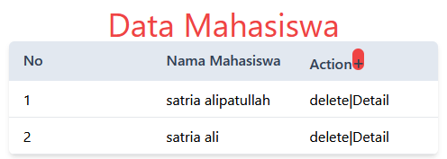
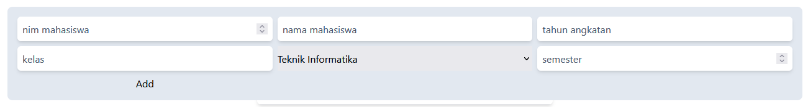

This is a [Next.js](https://nextjs.org/) project bootstrapped with [`create-next-app`](https://github.com/vercel/next.js/tree/canary/packages/create-next-app).

## Getting Started
di asumsikan sudah menginstall docker desktop: install mysql images & setup environment for db server

```bash
docker run --name student-dms -p 3306:3306 -e MYSQL_ROOT_PASSWORD=secret123 -d mysql
```
rename .env.example to .env
run the development server:
```bash
npm next dev
# or
pnpm next dev
```


